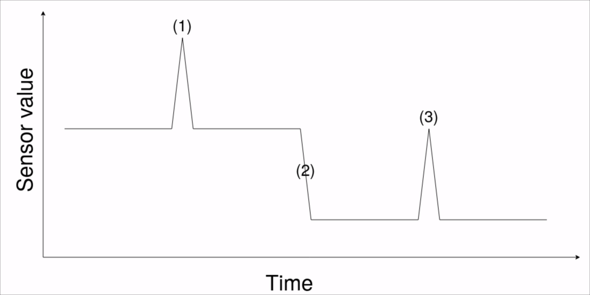

# MEDIUS DATA on INTRODUCTION to DATA SCIENCE 2023 course

Data will availabe to students of course on published url. 
This repo will serve as a guidance or starting point to make defined taks easier.

## Presentation
Presentation is available [here](https://docs.google.com/presentation/d/1_UCHO4S0kza_GXOTIvAe_Ace529RkHqLCMz1DEHN340/edit?usp=sharing).

## Homework instructions: Time-series anomaly detection

### Problem overview
The objective of this task is to identify anomalies within time-series data. The dataset comprises sensor readings obtained from an industrial wall-press in a production line. This production line is equipped with numerous sensors for monitoring various parameters such as temperature, pressure, voltage, vibration, and flow. The challenge is to detect when anomalies occur within the production line. These anomalies may arise due to a malfunctioning machine, a faulty sensor, or even human errors.

### What is an anomaly?
The definition of anomaly is context dependent. For our problem we define an anomaly as a sensor reading that is significantly higher from the previous readings. The following image shows two anomalies: 1 and 3 are considered anomalies, while 2 is not.



### Data set
The data set contains more than 2 months of sensor readings. The data is stored in file `TagLog.parquet` in the [parquet format](https://en.wikipedia.org/wiki/Apache_Parquet). To read the data you can use `pandas.read_parquet` function. The data set contains the following columns:
-   SensorId: ID of the sensor
-   SensorValue: Value of the sensor.
-   CreatedTime: Time when the sensor value was recorded

SensorId and CreatedTime have been psevdoanonymized. The CreatedTime is shifted by a random number of hours. An example of sensor data is shown below:
| SensorId | SensorValue | CreatedTime           |
|-------|----------|-----------------------|
| 809   | 0.000    | 2023-12-26 05:00:00.013 |
| 718   | 15.517   | 2023-12-26 05:00:00.020 |
| 122   | 10.250   | 2023-12-26 05:00:00.047 |
| 128   | 12.800   | 2023-12-26 05:00:00.060 |
| 317   | 0.000    | 2023-12-26 05:00:00.070 |
| ...   | ...    | ... |

Some SensorId represent productId, Quantity, Produced and CycleTime. These are not real sensor readings, but rather metadata about the production process. The ids of these sensors are:
- ProductId: 639
- Quantity: 878
- Produced: 507
- CycleTime: 899

Example read of data can be found in `notebooks/example_read.ipynb` notebook. Before running `example_read.ipynb`. Install required libraries using:
```
pip install -r requirements.txt
```

### Goal
Given the sensor readings answer the following questions:
-   When do anomalies occur in the production line?  Identify the timestamps at which anomalies take place.
-   What is the root cause of the anomalies? Investigate and determine the underlying causes of the anomalies, which could be attributed to machine malfunctions, sensor defects, or human errors.  
-   Are there any clusters of anomalies? Examine the data to uncover patterns or clusters of anomalies, which could provide valuable insights into the production process.
-   Which sensors are the most important for detecting anomalies? Determine which sensors play a significant role in detecting anomalies.


## Your partners

Medius d.o.o.
Tehnološki park 21
1000 Ljubljana


University of Ljubljana
Faculty of Computer and Information Science
Večna pot 113
1000 Ljubljana
